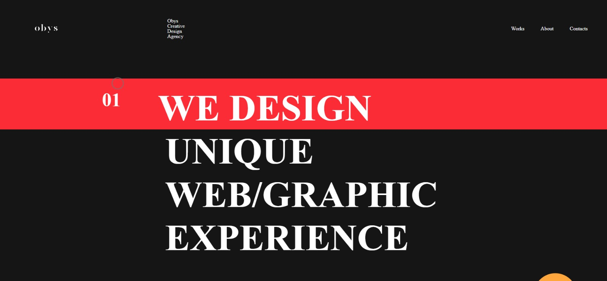
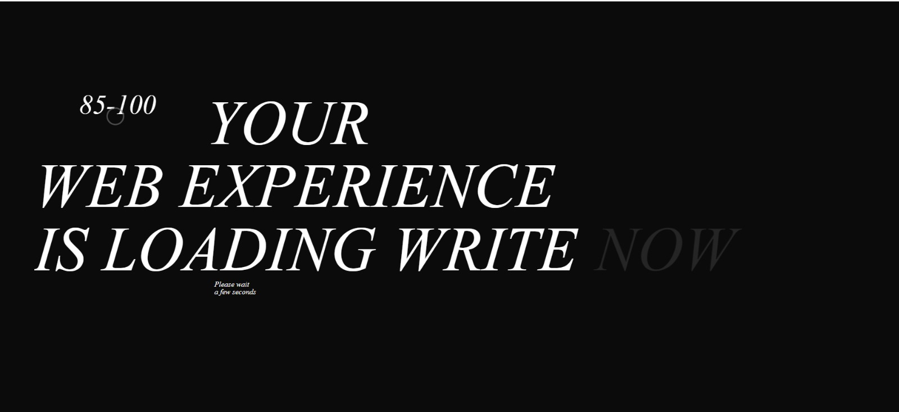

# 🎨 Obys Agency — UI Clone Project

Live Website: https://abdulalisawan.github.io/obys_agency/

---

## 📌 Project Overview

This project is a **UI clone of the Obys Agency website**, built to practice and demonstrate advanced frontend skills.  
The focus of this project is on **modern UI design, smooth animations, and pixel-perfect layout recreation** using pure frontend technologies.

The project replicates the visual style, layout structure, and animation behavior of the original Obys Agency website for **learning and educational purposes only**.

---

## 📸 Project Screenshot

Add a clean screenshot of the homepage.  
Save the image as `screenshot.png` in the root directory.

---

## ✨ Key Features

- Pixel-perfect UI clone of the Obys Agency website
- Smooth animations using GSAP
- Modern layout built with Tailwind CSS
- Fully responsive design for all screen sizes
- Clean and structured HTML markup
- Smooth scrolling and interactive sections
- Optimized animations for better performance

---

## 🧰 Technologies Used

Frontend:
- HTML5
- Tailwind CSS
- JavaScript
- GSAP (GreenSock Animation Platform)

---

## 📦 Main Dependencies

- tailwindcss
- gsap

---

## ⚙️ How to Run the Project Locally

Step 1: Clone the repository  
git clone https://github.com/Abdulalisawan/obys_agency.git  
cd obys_agency  

Step 2: Open the project  
Open the `index.html` file in your browser  
or use a live server extension for better experience

No backend or environment variables are required.

---

## 🔗 Project Resources

Live Website: https://abdulalisawan.github.io/obys_agency/  
GitHub Repository: https://github.com/Abdulalisawan/obys_agency  

---

## 🎯 Why This Project Matters

- Demonstrates strong frontend fundamentals
- Shows ability to recreate professional UI designs
- Hands-on experience with GSAP animations
- Focus on layout accuracy and responsiveness
- Built using pure frontend technologies without frameworks

---

## ⚠️ Disclaimer

This project is a **UI clone created for educational purposes only**.  
All design credits belong to **Obys Agency**.  
This project is not intended for commercial use.

---

## 👤 Author

Abdul Ali Sawan  
Frontend / Full Stack MERN Developer  
Dhaka, Bangladesh  

Email: dev.abdulalisawan@gmail.com  
GitHub: https://github.com/Abdulalisawan  
LinkedIn: https://www.linkedin.com/in/abdul-ali-sawan  

---

## ✅ Programming Hero Requirement Checklist

Project overview provided: ✅  
Live project link included: ✅  
Screenshot included: ✅  
Technologies listed clearly: ✅  
Dependencies mentioned: ✅  
Core features highlighted: ✅  
Local run instructions included: ✅  

---

⭐ If you like this project, consider giving it a star!
